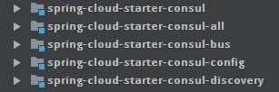

# Starter总览

## 成员组成

Spring Cloud Consul 的 starter 有一下5个：



1. spring-cloud-starter-consul
2. spring-cloud-starter-consul-bus

	依赖：spring-cloud-starter-consul

3. spring-cloud-starter-consul-config

	依赖：spring-cloud-starter-consul

4. spring-cloud-starter-consul-discovery

	依赖：spring-cloud-starter-consul

5. spring-cloud-starter-consul-all

	依赖上面 bus/config/discovery 三个starter。

总结： bus/config/discovery 三个starter 分别提供event bus/config/service registry-discovery 三个功能，然后他们都依赖到公共的starter spring-cloud-starter-consul。spring-cloud-starter-consul-all 则将这三个starter都放在一起。

## spring-cloud-starter-consul

主要依赖：

- spring-boot-starter-web： 为什么一定要有web？
- spring-cloud-commons
- spring-cloud-context
- spring-cloud-consul-core： 依赖到consul-core
- consul-api： 用的是 com.ecwid.consul的consul-api 这个客户端，之前用过，watch实现的非常糟糕，bug很多，代码也不稳定。

`META-INF/spring.provides` 文件的内容:

```bash
provides: spring-cloud-consul-core, consul-api
```

指明 spring-cloud-starter-consul 这个starter可以提供 spring-cloud-consul-core 和 consul-api 两个功能。

## spring-cloud-starter-consul-all

主要依赖：

- spring-cloud-starter-consul-bus
- spring-cloud-starter-consul-config
- spring-cloud-starter-consul-discovery

`META-INF/spring.provides` 文件的内容:

```bash
provides: spring-cloud-consul-bus, spring-cloud-consul-config, spring-cloud-consul-discovery, spring-cloud-consul-ui
```

TBD： 除了bus/config/discovery外，还提供了UI？没有找到是哪里提供的ui.

## spring-cloud-starter-consul-bus

主要依赖：

- spring-cloud-starter-consul
- spring-cloud-consul-binder
- spring-cloud-bus

`META-INF/spring.provides` 文件的内容:

```bash
provides: spring-cloud-consul-bus
```

TBD: 对 spring-cloud-bus 不熟，后面再来细看。

## spring-cloud-starter-consul-config

主要依赖：

- spring-cloud-starter-consul
- spring-cloud-consul-config
- spring-cloud-context

`META-INF/spring.provides` 文件的内容:

```bash
provides: spring-cloud-consul-config
```

## spring-cloud-starter-consul-discovery

主要依赖：

- spring-cloud-starter-consul
- spring-cloud-consul-discovery
- spring-cloud-netflix-core
- spring-cloud-starter-ribbon
- spring-boot-starter-web：又是需要web
provides: spring-cloud-consul-bus
`META-INF/spring.provides` 文件的内容:

```bash
provides: spring-cloud-consul-discovery
```


