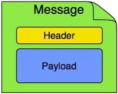
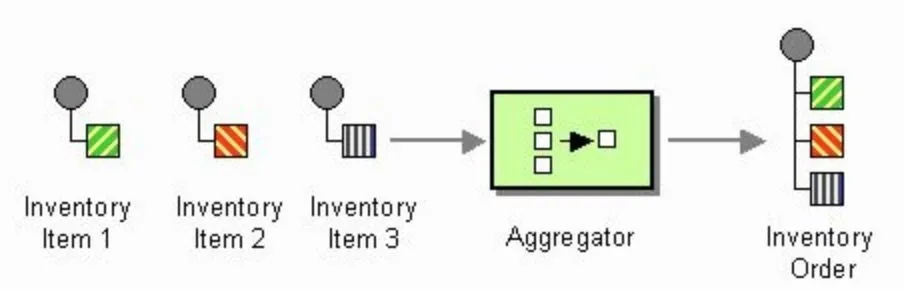
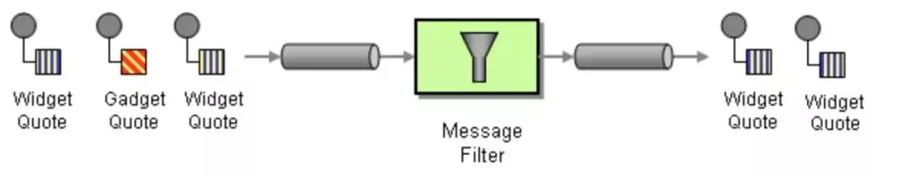
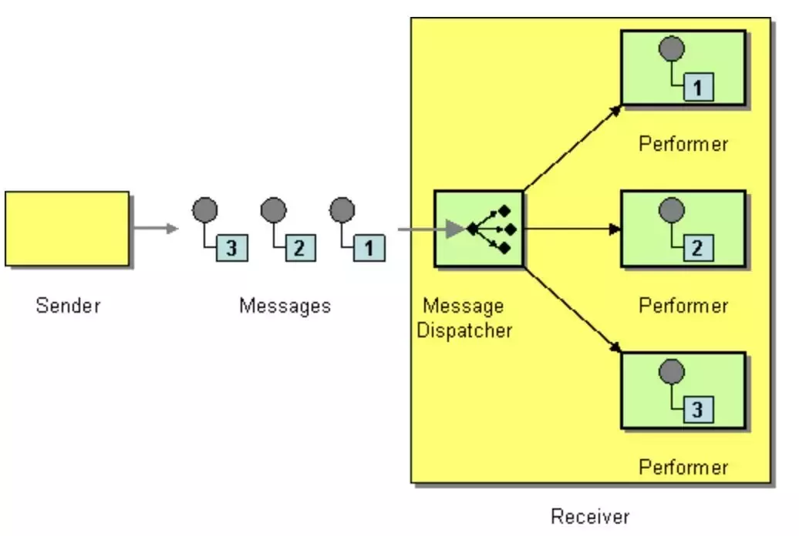
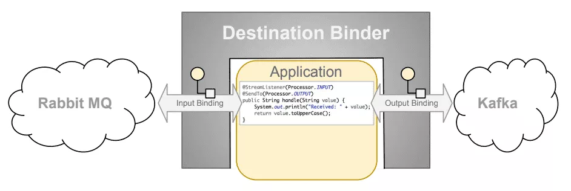

## 官方文档的说明

在 Spring Cloud Stream 的官方文档中，有这么一段说明:

[A Brief History of Spring’s Data Integration Journey](https://docs.spring.io/spring-cloud-stream/docs/current/reference/html/spring-cloud-stream.html#_a_brief_history_of_springs_data_integration_journey)

> Spring’s journey on Data Integration started with [Spring Integration](https://projects.spring.io/spring-integration/). With its programming model, it provided a consistent developer experience to build applications that can embrace [Enterprise Integration Patterns](http://www.enterpriseintegrationpatterns.com/) to connect with external systems such as, databases, message brokers, and among others.

Spring的数据集成之旅始于[Spring Integration](https://projects.spring.io/spring-integration/)。通过其编程模型，它为开发人员提供了一致的开发经验，以构建可以包含 [企业集成模式](http://www.enterpriseintegrationpatterns.com/) ，用来与外部系统（例如数据库，消息代理等）连接的应用程序。

> Fast forward to the cloud-era, where microservices have become prominent in the enterprise setting. [Spring Boot](https://projects.spring.io/spring-boot/) transformed the way how developers built Applications. With Spring’s programming model and the runtime responsibilities handled by Spring Boot, it became seamless to develop stand-alone, production-grade Spring-based microservices.

快进到云时代，微服务已在企业环境中变得突出。[Spring Boot](https://projects.spring.io/spring-boot/) 改变了开发人员构建应用程序的方式。借助 Spring 的编程模型和 Spring Boot 处理的运行时职责，无缝开发了基于spring的生产级的独立微服务。

> To extend this to Data Integration workloads, Spring Integration and Spring Boot were put together into a new project. Spring Cloud Stream was born.

为了将其扩展到数据集成工作负载，Spring Integration和Spring Boot被放到一个新项目中。Spring Cloud Stream 诞生了。

## 来自阿里云文章的说明

来自 阿里巴巴云原生公众号 的文章 (作者 洛夜) 更详细的阐述了  Spring Cloud Stream 项目的背景，尤其是  Spring Cloud Stream 项目和 Spring Messaging 和 Spring Integration 这两个项目的关系。

[Spring Cloud Stream 体系及原理介绍](https://developer.aliyun.com/article/783841)

> 以下内容摘录自该文章

### Spring Messaging

Spring Messaging 是 Spring Framework 中的一个模块，其作用就是统一消息的编程模型。

- 比如消息 Messaging 对应的模型就包括一个消息体 Payload 和消息头 Header：

  

  ```java
  package org.springframework.messaging;
  public interface Message<T> {
      T getPayload();
      MessageHeaders getHeaders();
  }
  ```

- 消息通道 MessageChannel 用于接收消息，调用send方法可以将消息发送至该消息通道中：

  

  ```java
  @FunctionalInterface
  public interface MessageChannel {
      long INDEFINITE_TIMEOUT = -1;
      default boolean send(Message<?> message) {
           return send(message, INDEFINITE_TIMEOUT);
       }
       boolean send(Message<?> message, long timeout);
  }
  ```

消息通道里的消息如何被消费呢？

- 由消息通道的子接口可订阅的消息通道SubscribableChannel实现，被MessageHandler消息处理器所订阅：

  ```java
  public interface SubscribableChannel extends MessageChannel {
      boolean subscribe(MessageHandler handler);
      boolean unsubscribe(MessageHandler handler);
  }
  ```

- 由MessageHandler真正地消费/处理消息：

  ```java
  @FunctionalInterface
  public interface MessageHandler {
      void handleMessage(Message<?> message) throws MessagingException;
  }
  ```

Spring Messaging 内部在消息模型的基础上衍生出了其它的一些功能，如：

- 消息接收参数及返回值处理：消息接收参数处理器HandlerMethodArgumentResolver配合@Header, @Payload等注解使用；消息接收后的返回值处理器HandlerMethodReturnValueHandler配合@SendTo注解使用；
- 消息体内容转换器MessageConverter；
- 统一抽象的消息发送模板AbstractMessageSendingTemplate；
- 消息通道拦截器ChannelInterceptor；

### Spring Integration

Spring Integration 提供了 Spring 编程模型的扩展用来支持企业集成模式(Enterprise Integration Patterns)，是对 Spring Messaging 的扩展。

它提出了不少新的概念，包括消息路由MessageRoute、消息分发MessageDispatcher、消息过滤Filter、消息转换Transformer、消息聚合Aggregator、消息分割Splitter等等。同时还提供了 MessageChannel 和 MessageHandler 的实现，分别包括 DirectChannel、ExecutorChannel、PublishSubscribeChannel 和 MessageFilter、ServiceActivatingHandler、MethodInvokingSplitter 等内容。

这里为大家介绍几种消息的处理方式：

- 消息的分割：

  

- 消息的聚合：

  

- 消息的过滤：

  

- 消息的分发：

  

接下来，我们以一个最简单的例子来尝试一下 Spring Integration。

这段代码解释为：

```java
SubscribableChannel messageChannel = new DirectChannel(); // 1

messageChannel.subscribe(msg-> { // 2
 System.out.println("receive: " +msg.getPayload());
});

messageChannel.send(MessageBuilder.withPayload("msgfrom alibaba").build()); // 3
```

- 构造一个可订阅的消息通道messageChannel。
- 使用MessageHandler去消费这个消息通道里的消息。
- 发送一条消息到这个消息通道，消息最终被消息通道里的MessageHandler所消费。
- 最后控制台打印出:receive: msg from alibaba。

DirectChannel内部有个UnicastingDispatcher类型的消息分发器，会分发到对应的消息通道MessageChannel中，从名字也可以看出来，UnicastingDispatcher是个单播的分发器，只能选择一个消息通道。那么如何选择呢? 内部提供了LoadBalancingStrategy负载均衡策略，默认只有轮询的实现，可以进行扩展。

我们对上段代码做一点修改，使用多个 MessageHandler 去处理消息：

```java
SubscribableChannel messageChannel = new DirectChannel();

messageChannel.subscribe(msg -> {
     System.out.println("receive1: " + msg.getPayload());
});

messageChannel.subscribe(msg -> {
     System.out.println("receive2: " + msg.getPayload());
});

messageChannel.send(MessageBuilder.withPayload("msg from alibaba").build());
messageChannel.send(MessageBuilder.withPayload("msg from alibaba").build());
```

由于DirectChannel内部的消息分发器是UnicastingDispatcher单播的方式，并且采用轮询的负载均衡策略，所以这里两次的消费分别对应这两个MessageHandler。控制台打印出：

```bash
receive1: msg from alibaba
receive2: msg from alibaba
```

既然存在单播的消息分发器UnicastingDispatcher，必然也会存在广播的消息分发器，那就是BroadcastingDispatcher，它被 PublishSubscribeChannel 这个消息通道所使用。广播消息分发器会把消息分发给所有的 MessageHandler：

```java
SubscribableChannel messageChannel = new PublishSubscribeChannel();

messageChannel.subscribe(msg -> {
     System.out.println("receive1: " + msg.getPayload());
});

messageChannel.subscribe(msg -> {
     System.out.println("receive2: " + msg.getPayload());
});

messageChannel.send(MessageBuilder.withPayload("msg from alibaba").build());
messageChannel.send(MessageBuilder.withPayload("msg from alibaba").build());
```

### Spring Cloud Stream

SCS 与各模块之间的关系是：

- SCS 在 Spring Integration 的基础上进行了封装，提出了Binder, Binding, @EnableBinding, @StreamListener等概念。
- SCS 与 Spring Boot Actuator 整合，提供了/bindings, /channels endpoint。
- SCS 与 Spring Boot Externalized Configuration 整合，提供了BindingProperties, BinderProperties等外部化配置类。
- SCS 增强了消息发送失败的和消费失败情况下的处理逻辑等功能。
- SCS 是 Spring Integration 的加强，同时与 Spring Boot 体系进行了融合，也是 Spring Cloud Bus 的基础。它屏蔽了底层消息中间件的实现细节，希望以统一的一套 API 来进行消息的发送/消费，底层消息中间件的实现细节由各消息中间件的 Binder 完成。

Binder是提供与外部消息中间件集成的组件，为构造Binding提供了 2 个方法，分别是bindConsumer和bindProducer，它们分别用于构造生产者和消费者。目前官方的实现有 Rabbit Binder 和 Kafka Binder， Spring Cloud Alibaba 内部已经实现了 RocketMQ Binder。



从图中可以看出，Binding是连接应用程序跟消息中间件的桥梁，用于消息的消费和生产。我们来看一个最简单的使用 RocketMQ Binder 的例子，然后分析一下它的底层处理原理：

- 启动类及消息的发送：

  ```java
  @SpringBootApplication
  @EnableBinding({ Source.class, Sink.class }) // 1
  public class SendAndReceiveApplication {

      public static void main(String[] args) {
          SpringApplication.run(SendAndReceiveApplication.class, args);
      }

         @Bean // 2
      public CustomRunner customRunner() {
          return new CustomRunner();
      }

      public static class CustomRunner implements CommandLineRunner {

          @Autowired
          private Source source;

          @Override
          public void run(String... args) throws Exception {
              int count = 5;
              for (int index = 1; index <= count; index++) {
                  source.output().send(MessageBuilder.withPayload("msg-" + index).build()); // 3
              }
          }
      }
  }
  ```

- 消息的接收：

  ```java
  @Service
  public class StreamListenerReceiveService {
  
      @StreamListener(Sink.INPUT) // 4
      public void receiveByStreamListener1(String receiveMsg) {
          System.out.println("receiveByStreamListener: " + receiveMsg);
      }
  }
  ```

这段代码很简单，没有涉及到 RocketMQ 相关的代码，消息的发送和接收都是基于 SCS 体系完成的。如果想切换成 RabbitMQ 或 Kafka，只需修改配置文件即可，代码无需修改。

我们来分析下这段代码的原理：

1. @EnableBinding对应的两个接口属性Source和Sink是 SCS 内部提供的。SCS 内部会基于Source和Sink构造BindableProxyFactory，且对应的 output 和 input 方法返回的 MessageChannel 是DirectChannel。output 和 input 方法修饰的注解对应的 value 是配置文件中 binding 的 name。

  ```java
  public interface Source {
      String OUTPUT = "output";
      @Output(Source.OUTPUT)
      MessageChannel output();
  }
  public interface Sink {
      String INPUT = "input";
      @Input(Sink.INPUT)
      SubscribableChannel input();
  }
  ```

配置文件里 bindings 的 name 为 output 和 input，对应Source和Sink接口的方法上的注解里的 value：

  ```properties
  spring.cloud.stream.bindings.output.destination=test-topic
  spring.cloud.stream.bindings.output.content-type=text/plain
  spring.cloud.stream.rocketmq.bindings.output.producer.group=demo-group

  spring.cloud.stream.bindings.input.destination=test-topic
  spring.cloud.stream.bindings.input.content-type=text/plain
  spring.cloud.stream.bindings.input.group=test-group1
  ```

1. 构造CommandLineRunner，程序启动的时候会执行CustomRunner的run方法。
2. 调用Source接口里的 output 方法获取DirectChannel，并发送消息到这个消息通道中。这里跟之前 Spring Integration 章节里的代码一致。

- Source 里的 output 发送消息到DirectChannel消息通道之后会被AbstractMessageChannelBinder#SendingHandler这个MessageHandler处理，然后它会委托给AbstractMessageChannelBinder#createProducerMessageHandler创建的 MessageHandler 处理(该方法由不同的消息中间件实现)。
- 不同的消息中间件对应的AbstractMessageChannelBinder#createProducerMessageHandler方法返回的 MessageHandler 内部会把 Spring Message 转换成对应中间件的 Message 模型并发送到对应中间件的 broker。

1. 使用@StreamListener进行消息的订阅。请注意，注解里的Sink.input对应的值是 "input"，会根据配置文件里 binding 对应的 name 为 input 的值进行配置：

- 不同的消息中间件对应的AbstractMessageChannelBinder#createConsumerEndpoint方法会使用 Consumer 订阅消息，订阅到消息后内部会把中间件对应的 Message 模型转换成 Spring Message。
- 消息转换之后会把 Spring Message 发送至 name 为 input 的消息通道中。
- @StreamListener对应的StreamListenerMessageHandler订阅了 name 为 input 的消息通道，进行了消息的消费。

这个过程文字描述有点啰嗦，用一张图总结一下(黄色部分涉及到各消息中间件的 Binder 实现以及 MQ 基本的订阅发布功能)：


SCS 章节的最后，我们来看一段 SCS 关于消息的处理方式的一段代码：

```java
@StreamListener(value = Sink.INPUT, condition = "headers['index']=='1'")
public void receiveByHeader(Message msg) {
     System.out.println("receive by headers['index']=='1': " + msg);
}

@StreamListener(value = Sink.INPUT, condition = "headers['index']=='9999'")
public void receivePerson(@Payload Person person) {
     System.out.println("receive Person: " + person);
}

@StreamListener(value = Sink.INPUT)
public void receiveAllMsg(String msg) {
     System.out.println("receive allMsg by StreamListener. content: " + msg);
}

@StreamListener(value = Sink.INPUT)
public void receiveHeaderAndMsg(@Header("index") String index, Message msg) {
     System.out.println("receive by HeaderAndMsg by StreamListener. content: " + msg);
}
```

有没有发现这段代码跟 Spring MVC Controller 中接收请求的代码很像? 实际上他们的架构都是类似的，Spring MVC 对于 Controller 中参数和返回值的处理类分别是org.springframework.web.method.support.HandlerMethodArgumentResolver、org.springframework.web.method.support.HandlerMethodReturnValueHandler。

Spring Messaging 中对于参数和返回值的处理类之前也提到过，分别是org.springframework.messaging.handler.invocation.HandlerMethodArgumentResolver、org.springframework.messaging.handler.invocation.HandlerMethodReturnValueHandler。

它们的类名一模一样，甚至内部的方法名也一样。

## 总结

SCS 是 Spring Integration 的加强，同时与 Spring Boot 体系进行了融合，也是 Spring Cloud Bus 的基础。

值得特别关注的是：

- “它屏蔽了底层消息中间件的实现细节，希望以统一的一套 API 来进行消息的发送/消费，底层消息中间件的实现细节由各消息中间件的 Binder 完成。”

- “通过其编程模型，它为开发人员提供了一致的开发经验”

- “代码很简单，没有涉及到 RocketMQ 相关的代码，消息的发送和接收都是基于 SCS 体系完成的。如果想切换成 RabbitMQ 或 Kafka，只需修改配置文件即可，代码无需修改。”

这个理念和 Dapr 的 pub/sub 构建块的设计初衷很相似。

类似的总结在这个文章中也有提到：

[官方文档中文版！Spring Cloud Stream 快速入门](https://developer.aliyun.com/article/743395?spm=a2c6h.14164896.0.0.2c9268c5JcKHmE)：

Spring Cloud Stream 解决什么问题：

- 无感知的使用消息中间件

  Stream解决了开发人员无感知的使用消息中间件的问题，因为Stream对消息中间件的进一步封装，可以做到代码层面对中间件的无感知。

- 中间件和服务的高度解耦

  Spring Cloud Stream进行了配置隔离，只需要调整配置，开发中可以动态的切换中间件(如rabbitmq切换为kafka)，使得微服务开发的高度解耦，服务可以关注更多自己的业务流程。

