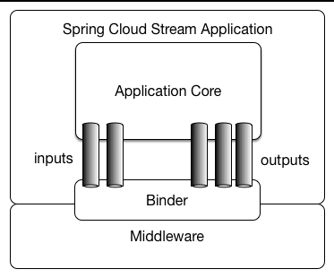

## 官方文档的描述

> 内容摘录自官方文档  [Application Model](https://docs.spring.io/spring-cloud-stream/docs/current/reference/html/spring-cloud-stream.html#spring-cloud-stream-overview-application-model) 一节

Spring Cloud Stream 应用程序由一个中间件中立的核心组成。应用程序通过在外部 broker 暴露的目的地和你代码中的输入/输出参数之间建立 binding (绑定) 来与外部世界进行通信。建立 binding 所需的特定 broker 细节由特定于中间件的 Binder 实现来处理。

