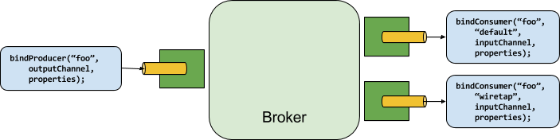

> 内容摘录自官方文档 [Producers and Consumers](https://docs.spring.io/spring-cloud-stream/docs/current/reference/html/spring-cloud-stream.html#_producers_and_consumers) 一节

下图显示了生产者和消费者的一般关系：

生产者是任何向绑定目的地发送消息的组件。绑定目的地可以被绑定到一个外部的消息代理，并为该代理实现一个Binder。当调用 `bindProducer()` 方法时，第一个参数是 broker 中的目的地名称，第二个参数是生产者发送消息的本地目的地的实例，第三个参数包含了在为该绑定目的地创建的适配器中使用的属性（比如分区键表达式）。

消费者是任何从绑定目的地接收消息的组件。与生产者一样，消费者可以被绑定到一个外部消息代理。当调用 `bindConsumer()` 方法时，第一个参数是目的地名称，第二个参数提供消费者的逻辑组的名称。每个由给定目的地的消费者绑定所代表的组都会收到生产者发送给该目的地的每个消息的副本（也就是说，它遵循正常的发布-订阅语义）。如果有多个消费者实例与同一组名称绑定，那么消息在这些消费者实例之间进行负载平衡，以便生产者发送的每条消息只被每个组内的一个消费者实例所消费（也就是说，它遵循正常的排队语义）。