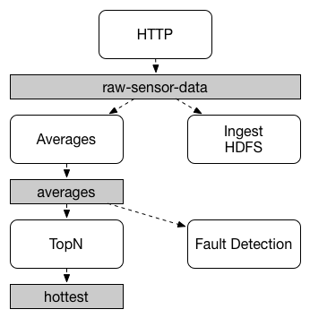

## 官方文档的描述

> 内容摘录自官方文档 [Persistent Publish-Subscribe Support](https://docs.spring.io/spring-cloud-stream/docs/current/reference/html/spring-cloud-stream.html#spring-cloud-stream-overview-persistent-publish-subscribe-support) 一节

应用程序之间的通信遵循 发布-订阅 （publish-subscribe model）模型，数据通过共享主题进行广播。这可以从下图中看出，该图显示了一组相互交流的 Spring Cloud Stream 应用程序的典型部署。

由传感器报告给HTTP端点的数据被发送到一个名为 `raw-sensor-data` 的共同目的地。从目的地开始，它被一个计算时间窗口平均数的微服务应用程序和另一个将原始数据摄入HDFS（Hadoop分布式文件系统）的微服务应用程序独立处理。为了处理数据，这两个应用程序都在运行时声明该主题为其输入。

发布-订阅通信模型降低了生产者和消费者的复杂性，并让新的应用程序被添加到拓扑结构中，而不会破坏现有的流程。例如，在平均计算应用程序的下游，你可以添加一个计算最高温度值的应用程序，用于显示和监控。然后，你可以添加另一个应用程序，解释相同的平均数流以进行故障检测。通过共享主题而不是点对点队列进行所有通信，可以减少微服务之间的耦合。

虽然发布-订阅消息的概念并不新鲜，但Spring Cloud Stream采取了额外的措施，使之成为其应用模型的意见选择。通过使用原生中间件支持，Spring Cloud Stream还简化了发布-订阅模型在不同平台上的使用。

